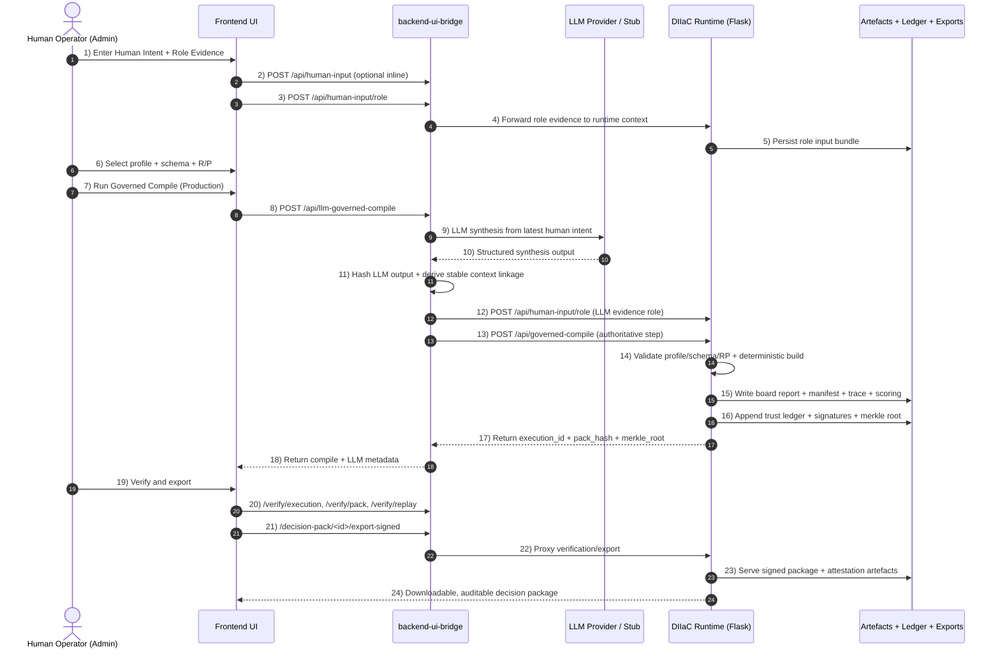

# DIIaC Visual Workflow Diagram (HITL + Deterministic Governance)

This diagram shows the **correct production sequence** for Human-In-The-Loop (HITL) operation where LLM assistance is combined with deterministic governed compile and verifiable artefacts.

## Correct usage policy
- Use this production path for all final decisions.
- Keep `/govern/decision` only for exploratory drafts/demos.
- Treat deterministic compile output as the authoritative decision artefact.
