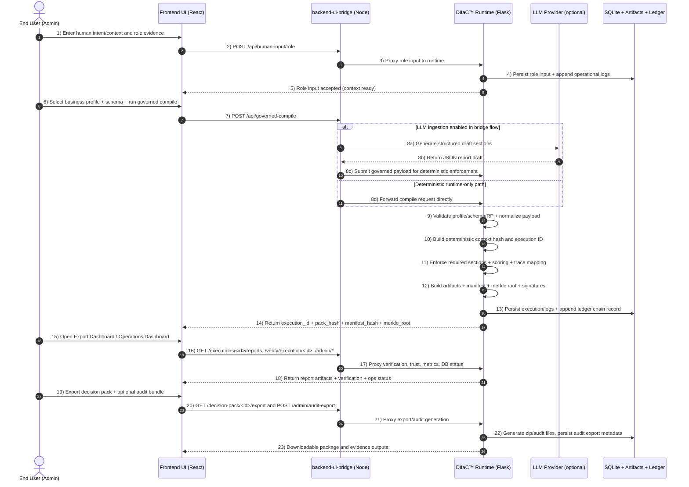

# DIIaC™ Frontend Console

This UI provides the DIIaC™ (Decision Intelligence Infrastructure as Code) operational workflow:
- governed compile
- evidence/report review
- export generation
- logs/metrics/admin operations

## Run locally

```bash
cd Frontend
npm ci
npm run dev -- --host 0.0.0.0 --port 5173
```

The backend bridge should be running at `http://localhost:3001` and Python runtime at `http://localhost:8000`.

## End-user workflow (step-by-step)

1. **Open UI** at `http://localhost:5173`.
2. **Choose Mode**:
   - `Customer` for non-admin review and trust checks.
   - `Admin` for compile + operational controls.
3. **Provide human context** in the Human Input panel and submit.
4. **Run governed compile**:
   - Add execution context + role evidence in Multi-Role Governed Compile.
   - Select the relevant business profile.
   - Select allowed schema for that profile.
   - Run compile and capture returned execution ID.
5. **Review generated artifacts** in the Export Dashboard:
   - refresh artifact list
   - export decision pack
6. **Open Operations Dashboard (admin)**:
   - Overview tab: service status, trust/metrics, DB integrity, container visibility.
   - Exports tab: execution verification + audit export generation.
   - Logs tab: backend/ledger/execution logs.
   - DB Maintenance tab: status + compact operation.
7. **Share stakeholder package**:
   - export generated pack
   - include verification/audit outputs
   - include selected logs and metrics snapshots


## Workflow diagram: Human intent → LLM-populated report (end-to-end)



### Sequence details (UI perspective)

1. Create an execution context by submitting at least one role input.
2. Choose business profile and schema in the compile panel.
3. Run governed compile to produce execution artifacts.
4. Review reports in the Export Dashboard.
5. Validate execution integrity in Operations Dashboard (Overview/Exports tabs).
6. Inspect logs and DB status in Logs and DB Maintenance tabs.
7. Export the decision pack and (optionally) generate an audit export for stakeholders.

> Note: Final report completeness is always bounded by governance enforcement rules (profile/schema/RP). If LLM generation is active, runtime governance still validates and deterministically enforces required sections before release.

## Creating a technical solution validation report

Recommended structure for a stakeholder-facing report:

1. **Objective & scope**
2. **Input context and assumptions**
3. **Business profile + schema selection rationale**
4. **Governed compile outputs** (execution ID, pack hash, manifest hash, merkle root)
5. **Evidence trace and scoring summary**
6. **Verification evidence** (`/verify/execution`, pack/merkle verification)
7. **Operational evidence** (service status, metrics, trust ledger growth)
8. **Audit export reference** (audit export ID + timestamp)
9. **Decision recommendation and next actions**

Use raw JSON only as appendices; keep main body concise and executive-readable.
