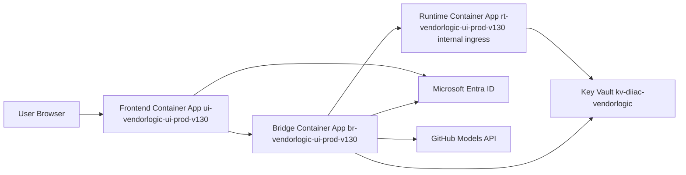
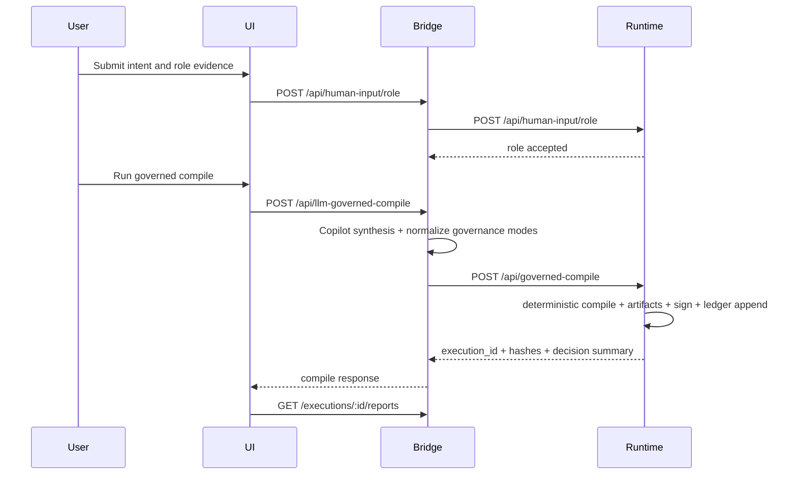
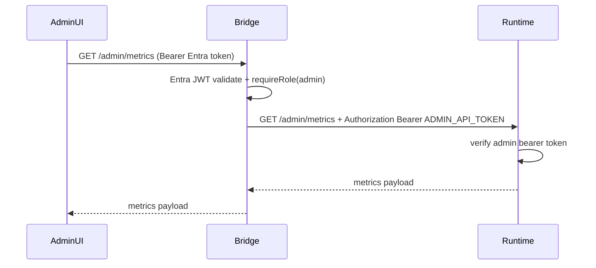

# DIIaC v1.3.0-ui Architecture Blueprint (Low-Level Design)

## Document Control
- Document status: Authoritative
- Build baseline: `v1.3.0-ui`
- Last updated: 2026-03-12
- Primary audience: platform engineers, security engineers, SRE, deployment operators
- Scope: implementation-level architecture for frontend, bridge, runtime, persistence, and dedicated Azure deployment

## 1. Purpose And Scope
This blueprint defines the low-level design (LLD) for the deployed DIIaC UI stack and the associated governance runtime path.

Included in scope:
- React frontend authentication and role handling
- Node.js bridge control plane, proxying, intercept governance, and operational endpoints
- Python runtime deterministic governance engine, signing, verification, and persistence
- Dedicated Azure Container Apps deployment topology and resource wiring
- Security boundaries, secret usage, and trust model
- Known design limitations and technical debt

Out of scope:
- Product strategy and roadmap narrative
- Historical deployment models except where needed for compatibility notes

## 2. Authoritative Source Files
Implementation details in this blueprint are derived from:
- `Frontend/src/main.tsx`
- `Frontend/src/App.tsx`
- `Frontend/src/api.ts`
- `Frontend/src/auth/authConfig.ts`
- `Frontend/src/auth/roleMapping.ts`
- `Frontend/src/auth/auth.ts`
- `backend-ui-bridge/server.js`
- `backend-ui-bridge/auth/entra.js`
- `backend-ui-bridge/auth/rbac.js`
- `backend-ui-bridge/llm-ingestion/providers/copilot.js`
- `app.py`
- `persistence.py`
- `infra/aca-dedicated-ui/main.sub.bicep`
- `infra/aca-dedicated-ui/main.rg.bicep`
- `infra/aca-dedicated-ui/vendorlogic-prod.sub.bicepparam`
- `infra/aca-dedicated-ui/modules/keyvault-secrets-user-role.bicep`
- `scripts/deploy-azure-dedicated-ui.sh`
- `scripts/build-push-dedicated-ui-images.sh`

## 3. System Context

## 4. Dedicated Azure Topology
### 4.1 Subscription And Tenant
- Subscription ID: `3ed9fa77-6bf2-4ffc-bd67-f5a442d3e5e7`
- Tenant ID: `1384b1c5-2bae-45a1-a4b4-e94e3315eb41`
- Region: `uksouth`

### 4.2 Resource Inventory (Dedicated UI Stack)
| Resource | Name | Type | Purpose |
|---|---|---|---|
| Resource Group | `RG_UI_VENDORLOGIC_PROD_V130` | `Microsoft.Resources/resourceGroups` | Isolated UI environment boundary |
| Container Registry | `acrdiiacv130vlui` | `Microsoft.ContainerRegistry/registries` | Runtime, bridge, and frontend images |
| Managed Identity | `id-vendorlogic-ui-prod-v130` | `Microsoft.ManagedIdentity/userAssignedIdentities` | ACR pull and Key Vault secret reference identity |
| Log Analytics | `law-vendorlogic-ui-prod-v130` | `Microsoft.OperationalInsights/workspaces` | ACA logs and diagnostics |
| Storage Account | `stdiiacv130vlui01` | `Microsoft.Storage/storageAccounts` | Persistent Azure Files backing ACA mounted volumes |
| Container Apps Environment | `acae-vendorlogic-ui-prod-v130` | `Microsoft.App/managedEnvironments` | Shared environment for three apps |
| Runtime App | `rt-vendorlogic-ui-prod-v130` | `Microsoft.App/containerApps` | Deterministic governance engine |
| Bridge App | `br-vendorlogic-ui-prod-v130` | `Microsoft.App/containerApps` | API gateway, auth, orchestration |
| Frontend App | `ui-vendorlogic-ui-prod-v130` | `Microsoft.App/containerApps` | React SPA hosting |
| Shared Key Vault (existing) | `kv-diiac-vendorlogic` in `RG_ROOT` | `Microsoft.KeyVault/vaults` | Secret source (shared by contract) |

### 4.3 Ingress And Network Shape
- Runtime app ingress:
  - External: `false`
  - Target port: `8000`
  - Access path: internal FQDN only (`https://<runtime>.internal.<envDefaultDomain>`)
- Bridge app ingress:
  - External: `true`
  - Target port: `3001`
  - Consumed by frontend as API base
- UI app ingress:
  - External: `true`
  - Target port: `5173`
  - Bound to custom domain `diiacui.vendorlogic.io`

### 4.4 DNS And Domain Outputs
`main.rg.bicep` outputs for DNS binding:
- `dnsCnameHost` -> `diiacui`
- `dnsCnameTarget` -> ACA UI app FQDN
- `dnsTxtHost` -> `asuid.diiacui`
- `dnsTxtValue` -> ACA custom domain verification ID

### 4.5 Scale Defaults
All apps default to single-replica max with scale-to-zero enabled:
- Runtime: min `0`, max `1`
- Bridge: min `0`, max `1`
- UI: min `0`, max `1`

### 4.6 Persistent Volume Topology (Dedicated ACA)
ACA environment storages are mapped to Azure File shares and mounted into runtime and bridge containers:
- Runtime mounts:
  - `/app/artifacts` -> `runtime-artifacts-storage`
  - `/app/exports` -> `runtime-exports-storage`
  - `/app/audit_exports` -> `runtime-audit-storage`
  - `/app/state` -> `runtime-state-storage`
- Bridge mounts:
  - `/workspace/artefacts/human-input` -> `bridge-human-input-storage`
  - `/workspace/artefacts/decision-packs` -> `bridge-decision-packs-storage`
  - `/workspace/state` -> `bridge-state-storage`
  - `/workspace/ledger` -> `bridge-ledger-storage`

This prevents loss of runtime artifacts, SQLite state, and bridge operations state across restarts and scale events.

## 5. Container Build And Runtime Layout
### 5.1 Frontend Container
- Build base: `node:24-bookworm`
- Runtime base: `node:24-bookworm-slim`
- Runtime command: `npx vite preview --host --port 5173`
- Build-time env args embedded into static bundle:
  - `VITE_API_BASE`
  - `VITE_ENTRA_CLIENT_ID`
  - `VITE_ENTRA_TENANT_ID`
  - `VITE_ENTRA_REDIRECT_URI`
  - `VITE_ENTRA_GROUP_MAP`

### 5.2 Bridge Container
- Base: `node:20-bullseye`
- Includes PowerShell package installation
- Runtime command: `node server.js`
- Port: `3001`
- Creates workspace paths:
  - `/workspace/artefacts/human-input`
  - `/workspace/artefacts/decision-packs`
  - `/workspace/ledger`
  - `/workspace/contracts/keys`

### 5.3 Runtime Container
- Base: `python:3.11-slim`
- Runtime command: `python3 app.py`
- Port: `8000`
- Copies contracts into image (`contracts/`)
- Uses filesystem directories under `/app`:
  - `artifacts`
  - `exports`
  - `audit_exports`
  - `state`

## 6. Frontend Low-Level Design
### 6.1 Bootstrap Flow
`main.tsx`:
1. Creates MSAL provider only when `msalInstance` exists.
2. Routes:
   - `/auth/callback` -> `AuthCallback`
   - `/*` -> `App`
3. If MSAL is unavailable, renders `App` without `MsalProvider`.

### 6.2 Auth And Role Resolution
- `authConfig.ts` defaults to Vendorlogic IDs if `VITE_ENTRA_*` is absent.
- `App.tsx` resolves effective role via `resolveRole(idTokenClaims)`.
- Role mapping precedence in frontend:
  1. Named app roles in token (`roles`) when matching known role labels.
  2. Group OID mapping from `VITE_ENTRA_GROUP_MAP` or default map.
  3. Fallback role: `viewer`.
- Access token handling:
  - ID token acquired via `acquireTokenSilent({ scopes: ["openid", "profile"] })`.
  - Token stored in in-memory auth module (`setAccessToken`) plus optional session storage fallback.

### 6.3 API Client Contract
`api.ts` sends:
- `Authorization: Bearer <token>` when token exists
- Otherwise fallback `x-role` header (legacy/dev path)

Primary frontend API groups:
- Governance operations: compile, reports, exports
- Trust and verification
- Admin: health, metrics, logs, DB, audit export
- Integrations dashboard: auth status, trends, effective config, approval queue

### 6.4 UI Capability Partition
| Role | UI access pattern |
|---|---|
| `admin` | Full workflow plus compile controls, trust dashboard, impact view, admin console |
| `standard` | Human input and report viewing paths; no admin panels |
| `viewer` | Authenticated read-only baseline through role gate behavior |

## 7. Bridge Low-Level Design
### 7.1 Runtime Responsibilities
- Enforce identity and role checks (Entra JWT + `requireRole`)
- Host governance-specific endpoints
- Proxy runtime APIs and inject runtime admin bearer token for `/admin/*`
- Orchestrate LLM-governed compile (`/api/llm-governed-compile`)
- Persist operational state for intercept/config/approval workflows

### 7.2 Authentication Middleware Pipeline
1. `entraAuth()` executes globally.
2. If `AUTH_MODE` is `entra_jwt_rs256` or `entra_jwt_hs256`:
   - Validates bearer token.
   - Validates tenant/audience/issuer.
   - Resolves role from claims/groups/principal map.
   - Writes resolved role into `x-role` header.
   - Populates `req.entraAuth`.
3. `requireRole([...])` checks role and populates `req.actor` lineage object.

Public unauthenticated paths in Entra middleware:
- `/health`
- `/readiness`
- `/auth/status`
- `/auth/callback`

Bridge now implements both `/health` and `/readiness`, with readiness requiring bridge-state writeability and runtime reachability.

### 7.3 Entra Role Resolution Rules (Bridge)
Priority order in `entra.js`:
1. `roles` claim interpreted as group OID mapping entries when present.
2. `roles` claim interpreted as named app roles (`admin`, `standard`, `customer`, `viewer`, `StandardUser`).
3. `groups` claim via `ENTRA_GROUP_TO_ROLE_JSON`.
4. `appid` or `azp` via `ENTRA_PRINCIPAL_TO_ROLE_JSON`.

### 7.4 Bridge Endpoint Matrix
| Endpoint | Method | Role Gate | Behavior |
|---|---|---|---|
| `/health` | GET | none | Bridge liveness payload |
| `/readiness` | GET | none | Bridge readiness (state writeability + runtime reachability) |
| `/trust` | GET | admin, standard, customer | Trust summary from runtime `/trust/status` |
| `/api/human-input` | POST | admin, standard, customer | Writes JSON payload to bridge human-input folder |
| `/api/impact/policy` | POST | admin | Policy impact simulation stub |
| `/api/llm-governed-compile` | POST | admin | LLM synthesis + deterministic runtime compile orchestration |
| `/executions/:id/reports` | GET | admin, standard, customer | Local artifact scan fallback then runtime proxy |
| `/executions/:id/reports/:file` | GET | admin, standard, customer | Local file serve fallback then runtime proxy |
| `/decision-pack/:id/export` | GET | admin | Runtime export proxy with signed-export fallback chain |
| `/verify/pack` | POST | admin, standard, customer | Runtime verification proxy |
| `/auth/status` | GET | none | Returns auth mode, tenant, audience, provider mode |
| `/auth/me` | GET | admin, standard, customer, viewer | Returns resolved identity context |
| `/auth/callback` | GET | none | OIDC callback helper payload |
| `/api/intercept/request` | POST | admin, standard, customer | Records request intercept and ledger entry |
| `/api/intercept/response` | POST | admin, standard, customer | Records response intercept and ledger entry |
| `/api/intercept/approval` | POST | admin | Records approval decision and ledger entry |
| `/admin/integrations/health` | GET | admin | Composite health across auth, llm, approval ops, runtime |
| `/admin/integrations/summary/trends` | GET | admin | Trend analytics from persisted intercept events |
| `/admin/config/effective` | GET | admin | Effective runtime config snapshot |
| `/admin/config/change-request` | POST | admin | Create config change request |
| `/admin/config/change-history` | GET | admin | List config change requests |
| `/admin/config/change-request/:id/decision` | POST | admin | Approve/reject config change |
| `/api/intercept/approval/pending` | GET | admin | List pending approvals |
| `/api/intercept/approval/submit` | POST | admin, standard, customer | Submit approval queue item |
| `/api/intercept/approval/decide` | POST | admin | Decide approval queue item |

Runtime-proxy bridge routes include:
- `/api/business-profiles`
- `/api/human-input/role`
- `/api/governed-compile`
- `/executions/:id/trace-map`
- `/executions/:id/scoring`
- `/executions/:id/merkle`
- `/executions/:id/merkle/proof/:artefact_name`
- `/verify/public-keys`
- `/verify/execution/:id`
- `/verify/merkle-proof`
- `/decision-pack/:id/export-signed`
- `/admin/health`
- `/admin/metrics`
- `/admin/db/status`
- `/admin/db/table/:table`
- `/admin/db/maintenance/compact`
- `/trust/status`
- `/admin/logs`
- `/admin/executions/:id/logs`
- `/admin/audit-export`
- `/admin/audit-export/:export_id/download`
- `/admin/audit/exports`

### 7.5 Runtime Proxy Behavior
`proxyToPython()`:
- Ensures runtime availability (`ensurePythonRuntime()`)
- Probes primary and fallback runtime URLs
- Optionally autostarts runtime (`PYTHON_AUTOSTART=true`) by spawning `python3 app.py`
- Injects `Authorization: Bearer ${ADMIN_API_TOKEN}` for proxied `/admin` routes
- Streams JSON or binary responses to caller

### 7.6 Bridge Operational Persistence
Persistent structure (`BRIDGE_STATE_PATH`):
- `config_change_requests`
- `approval_queue`
- `intercept_events` (bounded by `MAX_INTERCEPT_EVENTS`)

Persistence mode states:
- `persisted`
- `degraded_memory`
- `memory`

## 8. Runtime Low-Level Design
### 8.1 Startup Initialization
At app startup (`create_app()`):
1. Loads environment controls for deterministic mode, signing, evidence thresholds, and admin auth.
2. Initializes key pair:
   - Uses `SIGNING_PRIVATE_KEY_PEM` if configured.
   - Otherwise generates ephemeral Ed25519 key.
3. Initializes filesystem paths under current working directory.
4. Initializes SQLite store (`StateStore`) at `DIIAC_STATE_DB` or `state/diiac_state.db`.
5. Loads or updates `contracts/keys/public_keys.json`.
6. Loads business profiles and policy packs from contracts.
7. Restores persisted logs, ledger, executions, role inputs, and audit export index.
8. Validates ledger chain continuity at restore.

### 8.2 Runtime Admin Auth Boundary
`@app.before_request` enforces admin bearer auth for `/admin*` routes when:
- `ADMIN_AUTH_ENABLED=true`
- `APP_ENV` is not `dev` or `development`

Runtime admin auth is separate from Entra and is satisfied in production through bridge-side token injection for proxied admin routes.

### 8.3 Deterministic Compile Pipeline (`_build_execution`)
Pipeline stages:
1. Resolve profile and schema compatibility.
2. Resolve role bundle from persisted role inputs or inline fallback payload.
3. Normalize and enforce required governance modes.
4. Build deterministic input snapshot and hash.
5. Generate deterministic execution ID (UUIDv5) when strict deterministic mode is enabled.
6. Build option profiles from LLM or deterministic fallback.
7. Score options deterministically using profile weighting.
8. Evaluate evidence quality gates:
   - minimum strong refs
   - claim coverage
   - LLM freshness gate
9. Evaluate policy pack controls using required signal model.
10. Compute confidence score and recommendation state.
11. Generate board report and trace artifacts.
12. Build artifact hash set, Merkle tree, pack hash, governance manifest.
13. Sign signature payload and generate signature metadata.
14. Write all artifacts under `artifacts/<execution_id>/`.
15. Append ledger record and persist execution.

### 8.4 Runtime Artifact Catalog Per Execution
Generated artifact files include:
- `board_report.json`
- `board_report.md`
- `deterministic_compilation_log.json`
- `deterministic_input_snapshot.json`
- `evidence_trace_map.json`
- `role_input_bundle.json`
- `schema_contract.json`
- `vendor_scoring_matrix.json`
- `business_profile_snapshot.json`
- `profile_compliance_matrix.json`
- `policy_pack_compliance.json`
- `profile_override_log.json`
- `down_select_recommendation.json`
- `trace_map.json`
- `scoring.json`
- `governance_manifest.json`
- `signed_export.sigmeta.json`
- `signed_export.sig`
- `replay_certificate.json`
- `llm_analysis_raw.json` (present when LLM analysis is provided)

### 8.5 Runtime Endpoint Matrix
| Endpoint | Method | Purpose |
|---|---|---|
| `/health` | GET | Readiness summary |
| `/admin/health` | GET | Full health, trust readiness, ledger health |
| `/admin/config` | GET | Runtime config and policy gate settings |
| `/api/human-input/role` | POST | Persist role evidence input |
| `/api/business-profiles` | GET | Available profiles |
| `/api/governed-compile` | POST | Deterministic compile entrypoint |
| `/api/compile` | POST | Alias to governed compile |
| `/admin/executions` | GET | Execution list |
| `/admin/executions/<id>/logs` | GET | Execution-specific logs |
| `/admin/logs` | GET | Backend or ledger logs |
| `/admin/logs/backend` | GET | Backend logs |
| `/admin/logs/ledger` | GET | Ledger logs |
| `/admin/metrics` | GET | Runtime metrics summary |
| `/admin/db/status` | GET | DB status and integrity flags |
| `/admin/db/table/<table>` | GET | Table inspection |
| `/admin/db/maintenance/compact` | POST | DB VACUUM |
| `/executions/<id>/trace-map` | GET | Evidence trace map |
| `/executions/<id>/scoring` | GET | Scoring and recommendation |
| `/executions/<id>/merkle` | GET | Merkle structure |
| `/executions/<id>/merkle/proof/<artifact>` | GET | Merkle proof for artifact |
| `/verify/public-keys` | GET | Key registry |
| `/verify/execution/<id>` | GET | Execution verification summary |
| `/verify/pack` | POST | Signature/hash/manifest verification |
| `/verify/merkle-proof` | POST | Standalone Merkle proof check |
| `/verify/replay` | POST | Deterministic replay validation |
| `/trust/status` | GET | Ledger/trust status |
| `/decision-pack/<id>/export` | GET | Zip export |
| `/decision-pack/<id>/export-signed` | GET | Signed export metadata |
| `/admin/audit-export` | POST | Generate audit bundle |
| `/admin/audit/exports` | GET | List audit bundles |
| `/admin/audit/exports/<id>/download` | GET | Download audit bundle |
| `/admin/audit-export/<id>/download` | GET | Alias download endpoint |
| `/trust` | GET | Alias to `/trust/status` |
| `/api/human-input` | POST | Text input alias endpoint |
| `/executions/<id>/reports` | GET | List reports for execution |
| `/executions/<id>/reports/<file>` | GET | Get specific report file |

### 8.6 Runtime Persistence Schema
SQLite tables (`persistence.py`):
- `ledger`
- `backend_logs`
- `executions`
- `role_inputs`
- `audit_exports`

Notable indexes:
- `idx_backend_logs_execution`
- `idx_role_inputs_ctx`
- `idx_ledger_hash`

## 9. Security And Secret Architecture
### 9.1 Secret Sources
All secret values are sourced from Key Vault (`kv-diiac-vendorlogic`) via managed identity references in ACA.

### 9.2 Secret Mapping
| Secret Name | Consumer | Usage |
|---|---|---|
| `diiac-admin-api-token` | Runtime and Bridge | Runtime `/admin` bearer auth and bridge admin proxy injection |
| `diiac-signing-private-key-pem` | Runtime and Bridge | Ed25519 signing key material |
| `diiac-github-token` | Bridge | Copilot/GitHub Models provider API key |

### 9.3 Entra Security Controls
Bridge Entra validation controls:
- expected tenant (`ENTRA_EXPECTED_TENANT_ID`)
- accepted audience forms (`api://<app-id>` and bare `<app-id>`)
- issuer pinning (`ENTRA_EXPECTED_ISSUERS`)
- JWKS lookup (`ENTRA_JWKS_URI`)
- role and principal mapping from JSON envs

### 9.4 Signing Trust Readiness Criteria
Runtime marks production trust ready when all are true:
- signing enabled
- active key present in registry file
- key registry contains entries
- key is not local or ephemeral mode

## 10. Data Flow Sequences
### 10.1 End-To-End Governed Compile

### 10.2 Admin Runtime Access Through Bridge

## 11. Operational Characteristics
### 11.1 Deployment Gating Model
Expected deployment sequence:
1. `deploy-azure-dedicated-ui.sh --plan --infra-only`
2. `deploy-azure-dedicated-ui.sh --apply --infra-only`
3. `build-push-dedicated-ui-images.sh`
4. `deploy-azure-dedicated-ui.sh --plan --with-apps`
5. `deploy-azure-dedicated-ui.sh --apply --with-apps`
6. DNS/CNAME/TXT bind and validation for `diiacui.vendorlogic.io`

### 11.2 App Image Tags (Current Param Baseline)
- Runtime tag: `1.3.0-adminheaderfix`
- Bridge tag: `1.3.0-ingressfix`
- Frontend tag: `1.3.0-groupmapfix`

## 12. Known Technical Debt And Risks
1. Runtime persistence remains SQLite-on-Azure-Files and therefore constrained to single active writer semantics (runtime max replicas should remain `1` until managed DB migration).
2. Legacy `x-role` header fallback is retained as explicit local/dev opt-in only (`VITE_LEGACY_ROLE_HEADER_ENABLED`), and must remain disabled in production.
3. Continuous deployment gates should assert probe health and volume mount integrity before traffic promotion.

## 13. Design Decisions And Rationale
1. Dedicated ACA environment isolates UI stack from unrelated workloads.
2. Shared Entra + shared Key Vault preserve central identity and secret governance while isolating compute plane.
3. Bridge enforces identity and role controls before runtime invocation.
4. Runtime remains deterministic-first and records full artifact chain for replay and verification.
5. Copilot provider lock (`copilot_only`) removes multi-provider variance in production path.

## 14. Validation Checklist For LLD Compliance
- [ ] Entra auth mode in bridge is `entra_jwt_rs256`
- [ ] Runtime admin bearer auth is enabled in production env
- [ ] Key Vault secret references resolve for runtime and bridge
- [ ] ACA persistent Azure File shares are mounted and writable in runtime and bridge
- [ ] Bridge `/health` and `/readiness` return `200` after deployment warm-up
- [ ] `diiacui.vendorlogic.io` resolves and serves UI over TLS
- [ ] `VITE_ENTRA_REDIRECT_URI` equals `https://diiacui.vendorlogic.io/auth/callback`
- [ ] Compile flow produces expected artifact set and signature metadata
- [ ] Verification endpoints (`/verify/*`) return consistent hash/signature results
- [ ] Evidence pack capture is performed for deployment and smoke checks
