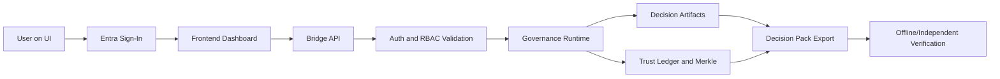

# Visual Workflow Diagram (v1.3.0-ui)

## Notes

- UI is externally accessible at `diiacui.vendorlogic.io`.
- Bridge enforces auth and orchestrates runtime operations.
- Runtime produces deterministic outputs and trust evidence.
